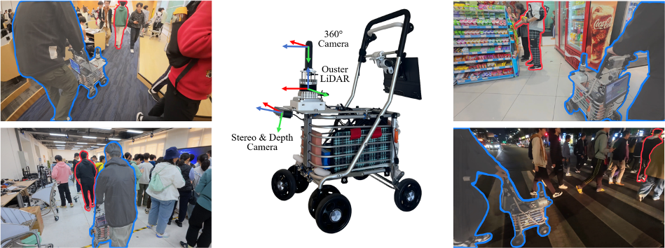

# TPT-Bench

> <b>TPT-Bench: A Large-Scale, Long-Term and Robot-Egocentric Dataset for Benchmarking Target Person Tracking </b> <br>
> Hanjing Ye, Yu Zhan, Weixi Situ, Guangcheng Chen, Jingwen Yu, Ziqi Zhao, Kuanqi Cai, Arash Ajoudani and Hong Zhang <br>
> Under Review<br>
> [<u>arXiv</u>](http://arxiv.org/abs/2505.07446/) [<u>site</u>](https://medlartea.github.io/tpt-bench/), [<u>video</u>](https://www.youtube.com/watch?v=wrgdsGKH1MQ)

<p align="center">

</p>

## NEWS

- (20250710) Release the TPT-Bench dataset and development tools


## Dataset Download and Organization
### 📥 Download

One Drive:
- [TPT-Bench](https://1drv.ms/f/c/45762558a76db9f8/Esuc-i6-XqRNjJhZKjabg3IBZJnK8K30Jz0NWYzugurxdA), keyword: rcvtptbench
- [rosbags (0000-0025)](https://1drv.ms/f/c/45762558a76db9f8/EoePvloZDlFJlXrvvWK1z6YBpdXIfaAc89Dv4PbZ3xyhAQ), keyword: rpfrosbag123!
- [rosbags (0026-0047)](https://1drv.ms/f/c/40f76eb9a7827e2a/Es0Dnmmf0-1Ji_9xy1oH1XUBYAjcOLfgeoYdUirAtFjXvg), keyword: rpfrosbag123!

Baidu Yun:
- [TPT-Bench](https://pan.baidu.com/s/1CIA809gCY2KzOAmlhL_lBA), keyword: pf25
- [rosbags](https://pan.baidu.com/s/1J5LOGTGExdj_F8dqrylEHQ), keyword: hj25

> ⚠️ Note: `0002.bag` is missing LiDAR and ZED recordings due to hardware issues.

> ⭐ Recommended Rosbag Download: `0015.bag` is the smallest bag for a simple trial

### 📁 Dataset Structure
```bash
TPT-Bench/
├── panoramic_images/
│   └── <seq_id>/
│       └── <timestamp>.jpg
├── GTs/
│   └── <seq_id>.json
├── rosbags/
│   └── <seq_id>.bag
├── descriptions/
│   └── <seq_id>.txt
├── quickview_videos/
│   └── <seq_id>.mp4
├── evaluation_results/
│   └── <seq_id>/
│       └── <baseline>.json
├── LICENSE.txt
```

## Tools
### 🔧 Installation:
Tested in Ubuntu 20.04, Python 3.7.16.
```bash
git clone https://github.com/MedlarTea/TPT-BENCH-TOOLS
conda create -n tptbench python==3.7.16
conda activate tptbench
pip install -r requirements.txt
python setup.py install
```
> ⚠️ If you encountered rospy problem, you might need to install ros-noetic package and source it.

### ▶️ Usage
0. Enter script path:
```bash
cd src
```

1. Evaluate baseline results:
```bash
python evaluate_baselines.py --dataset_dir /path/to/TPT-Bench
```
- Requires 
    - `$dataset_dir/evaluation_results`
    - `$dataset_dir/GTs`

2. Convert a sphere image (panoramic image) to a cylinder image (similar to pinhole-camera image)
```bash
python sphere_to_cylinder.py --dataset_dir /path/to/TPT-Bench \
                             --sequence_name 0015 \
                             --frame_index 20
```
- Requires: 
    - `$dataset_dir/panoramic_images/$sequence_name`

3. Collect rosbag data and store them in the `dataset_dir`
```bash
python write_bag_to_data.py --dataset_dir /path/to/TPT-Bench \
                            --sequence_name 0015 \
                            --zed_path_odom
```
- Requires:
    - bag file: `$dataset_dir/rosbags/{$sequence_name}.bag`
- Parameters (what data to be saved):
    - `--zed_path_odom`: saves `/zed2/zed_node/path_odom` to `$dataset_dir/odometry/$sequence_name`
    - `--zed_rgb`: saves `zed_rgb_image` to `$dataset_dir/zed_rgb_images/$sequence_name`
    - `--lidar_points`: saves `ouster_points` to `$dataset_dir/lidar_points/$sequence_name`


4. Project LiDAR points to the panoramic images or Zed RGB images
```bash
python visualize_depthmap.py --dataset_dir /path/to/TPT-Bench \
                             --sequence_name 0015 \
                             --frame_index 20 \
                             --camera_type theta_camera
```
- Requires: 
    - LiDAR data: `$dataset_dir/lidar_points/$sequence_name`
    - Images: either `$dataset_dir/panoramic_images/$sequence_name` or `$dataset_dir/zed_rgb_images/$sequence_name`
- Parameters:
    - `--camera_type`: `theta_camera` or `zed_camera`
    - `--frame_index`: visualized frame index
    - `--save_dir`: optionally save projected images to `$dataset_dir/theta_projected_images/$sequence_name` or `$dataset_dir/zed_projected_images/$sequence_name`


5. Tracking the target person on the ground plane
```bash
python tracking_on_ground_plane.py --dataset_dir /path/to/TPT-Bench \
                                   --sequence_name 0015
```
- Requires:
    - `$dataset_dir/panoramic_images/$sequence_name`
    - `$dataset_dir/lidar_points/$sequence_name`


## How to evaluate your tracking results
To evaluate your tracking results, please follow the JSON format provided in `$dataset_dir/evaluation_results` and use the evaluation script `evaluate_baselines.py`. A valid output JSON file should look like this:
```json
{
    "1727602424143298027": {
        "target_info": [
            881,
            255,
            155,
            425,
            0.9772515464890091
        ]
    }, 
    ...
}
```
- `1727602424143298027` --- Timestamp of the panoramic frame.
- `target_info` --- A list in the format `[u_top_left, v_top_left, width, height, target_confidence]`, representing the bounding box and confidence score of the target. Use `[0, 0, 0, 0, -1]` to indicate that the target is not present in the frame.

## Acknowledgement
We sincerely thank the contributors of the following open-source tools for their excellent work:
- [Fusionpotable Tools](https://github.com/fusionportable/fusionportable_dataset_tools)

## Citation
```
@article{ye2025tpt,
  title={TPT-Bench: A Large-Scale, Long-Term and Robot-Egocentric Dataset for Benchmarking Target Person Tracking},
  author={Ye, Hanjing and Zhan, Yu and Situ, Weixi and Chen, Guangcheng and Yu, Jingwen and Zhao, Ziqi and Cai, Kuanqi and Arash, Ajoudani and Zhang, Hong},
  journal={arXiv preprint arXiv:2505.07446},
  year={2025}
}
```
